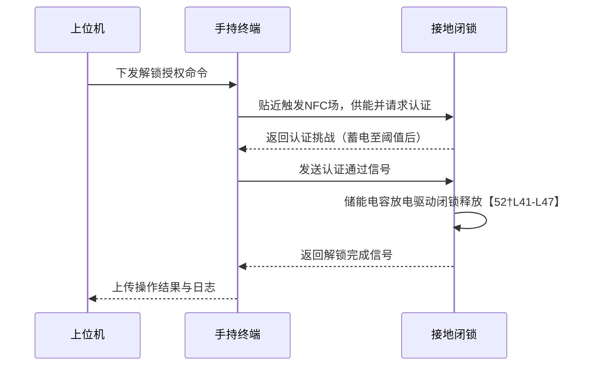

# 执行摘要  

根据项目需求和采购文件，**向家坝电站新增项目**共需**200套**基于**NFC认证的无源接地闭锁装置、30套手持式NFC解锁设备**以及**1套电子操作票上位机系统**。新型接地闭锁装置通过**无电源电容快速充放电**实现锁闭/解锁功能，手持终端通过触碰NFC完成身份认证并驱动闭锁装置，同时记录操作日志并上传。上位机系统负责远程下发授权命令、管理操作票并记录审计日志。针对每个子系统，我们列出详细的电气/机械规格、通信协议、电源和环境适应性要求，并评估无源电容快充的可行性和设计方案；同时分析NFC外设的技术方案和电子票系统的通信架构、授权流程。报告最后给出系统集成通信方案（含有线/无线选项和时序图）、验收测试项、风险与对策，以及初步的成本/物料清单与交付节奏假设。本报告着重参考了中文行业标准、专利和企业白皮书，如复旦微电子和兆易创新等国产解决方案以满足国产化和自主可控要求【42†L131-L139】【47†L1-L4】。

## 功能与数量核对  

- **项目内容**：采购文件中提出在向家坝电站各作业区增加智能接地闭锁装置，并建设以电子操作票管理的闭锁控制系统。用户描述理解为“200套新型接地闭锁装置、30套手持式NFC外设解锁装置、1个电子操作票上位机系统”，与采购文件总体一致。尚须进一步从技术附件确认精确数量分配。  
- **接地闭锁装置**：每套装置主要用于临时接地线两端的快速锁闭与解锁，须实现无源工作方式。常规闭锁方式见CN107171088B，采用可动挂钩和锁止件结构【50†L134-L138】；本项目新装置需在此基础上集成电子锁控功能与NFC认证。  
- **手持NFC解锁设备**：提供给现场操作人员，用于靠近闭锁装置时进行身份校验和驱动锁体释放，支持数据存储和与上位机通信，方便现场记录和巡检管理。  
- **电子操作票上位机系统**：作为后台管理系统，需运行在PC上，支持操作票的编制、审核、日志记录以及与手持设备的通信。类似专利CN115146942B中水电厂电子操作票系统，主机与手持终端通过无线通信连接【24†L42-L51】。上位机系统还需提供主备切换、高并发响应和日志审计等功能。  

以上理解与采购需求相符。后续应在技术规格中明确每项设备的具体数量、功能和交付节奏，如果未指定则注明“未指定”，并参考行业常见值。

## 子系统详细技术规格  

### 接地闭锁装置  

- **电气规格**：无源设计，无内部电源。通过手持NFC感应线圈瞬时供电后，对内置电容充电，然后驱动闭锁机构。闭锁和解锁动作可采用**电磁锁**或**电动夹爪**结构【4†L393-L402】【52†L41-L47】。电磁锁释放需瞬时大电流，故设计时需电容储能释放电路（参见后述快充方案）。应有位置传感开关检测线夹安装状态。电气接口：NFC线圈、控制芯片、传感器接口等。  
- **机械规格**：结构应适配输电线端夹（可参考鸭舌式线夹结构）【50†L134-L138】。闭锁装置包括挂钩和锁止机构，需能自动锁止导线【50†L134-L138】。机构需简单可靠，抗振动不易脱落（参照CN107171088B说明安装后锁止件锁紧导线【50†L134-L138】）。材料耐腐蚀，整体防护等级至少IP54或更高，以适应室外环境。  
- **通信协议**：与手持设备的通信主要通过**NFC（13.56MHz）近场感应**进行短距离交互，符合ISO/IEC 14443标准（Type A/B）【40†L149-L158】。NFC仅在解锁时触发，平常不主动通信。为了可靠起见，可设计备用低速无线（如蓝牙、LoRa）用于异常状态报告。  
- **功耗**：平时无耗电（无源）。解锁时电容经NFC充电后释放，整个动作周期内功耗来源于电容储能。设计需保证单次解锁所需能量在NFC供能范围内。  
- **充电时间**：目标是**快速充电**，通常希望在一次NFC感应（数百毫秒到几秒）内完成足够充电以触发动作。例如Kaiconn方案可瞬时完成充电驱动【52†L41-L47】。具体时间需根据电容容量和能量需求计算。  
- **响应时间**：从NFC接触到闭锁释放应尽量短（<2秒），见Mermaid时序示例。  
- **环境适应**：需满足电力设备常见环境（-40~+70℃、高湿、盐雾、防腐蚀、防震动）。可参照GB/T 2423系列环境试验标准进行设计验证。  
- **可靠性/寿命**：电容、NFC线圈等关键元件需寿命长（10万次操作以上）。闭锁机构寿命（机械耐用度）需≥5000次操作以上。采用低损耗设计和高寿命元器件。  
- **EMC/安全**：设计需符合国家或行业EMC标准，如GB/T 17626系列和GB/T 14409安规检测；高压系统需安装足够绝缘和接地保护。  
- **认证要求**：产品属于电力安全设备，须符合《电力安全工作规程》等相关标准。电子部分建议获取CCC认证（信息技术设备安全、无线电发射）和国标加密认证（如果采用国密算法）。  
- **接口要求**：需有NFC读写天线接口；可以预留外部编程接口（如UART/USB）用于固件升级；机械安装尺寸需统一，以兼容标准接地线夹。

### NFC手持解锁设备  

- **NFC类型/协议**：支持**ISO/IEC 14443 Type A/B** (13.56 MHz) 和/或 NFC Forum标准，兼容常用智能卡或标签。读写设备可采用标准芯片，如国产复旦微的NFC标签/双界面芯片【42†L131-L139】或ST、NXP等（但国产优先）。  
- **认证方式**：每位运维人员持有唯一**NFC ID卡**或终端内置加密ID。设备上通过密钥加解密与卡片相互认证，确保防克隆、防作弊。参考CN118379816A专利：NFC控制器内置电气设备信息和加密组件，NFC卡内嵌唯一ID和密钥【4†L397-L404】。鉴权方案可采用对称加密（AES128/国密SM4）或ECC认证。【4†L399-L402】【52†L82-L84】  
- **加密**：终端和卡片必须支持数据加密和完整性校验，防止中途篡改。可采用国密SM2/SM4标准或行业成熟算法。通信链路若使用Wi-Fi，应启用TLS/SSL。  
- **存储结构**：本地需存储记录**≥10000条**操作日志。每条记录含设备ID、时间戳、操作类型、操作人员ID等，大约几十字节/条。可使用外部闪存或TF卡，容量约1~2MB。需支持环形存储或分页管理，保证旧数据回收、加密防篡改。  
- **数据同步/上报**：配备Wi-Fi/以太网或4G模块，与上位机系统或云端同步日志。可支持定时/现场扫描上传。也可在每次操作后通过现场联网设备实时上传。数据格式通过安全API接口，建议采用JSON或专用协议加密上传。  
- **本地10000条数据管理**：应提供历史记录浏览功能（如屏显日志），并支持导出清除。记录应防误删并加密存储，确保审计追溯。  
- **UI/操作流程**：手持终端配置触摸屏和按键，界面友好易用。典型流程：开机→身份验证（输入密码或刷卡）→选择设备→NFC触碰地线装置→提示成功/失败→记录操作→上传数据。如CN115146942B所示，可内置视频/音频记录辅助审计【24†L42-L51】。由于现场使用环境，屏幕需防水、防尘，按键触感良好。  
- **电源**：手持设备供电可采用**锂电池**（3.7V），容量视功耗而定（可支持连续工作≥8小时）。可标配充电座或USB-C充电。电源管理电路需支持过充过放保护。  
- **防护**：外壳需符合人体工学设计，抗跌落（≥1.2米）和抗摔。整机应满足IP65以上等级（防尘、防水）。应有指示灯和响铃反馈。  
- **通信协议**：除了NFC近场（被动），终端与主站可采用**Wi-Fi (IEEE 802.11)** 或 **工业以太网**通讯。可根据现场网络情况决定，优选工业Wi-Fi。也可备选**蓝牙**或**蜂窝移动网**（NB-IoT/4G）。  

### 电子操作票上位机系统  

- **通信架构**：系统采用**分布式架构**。PC端作为主机（主用/备用双机），与手持终端通过无线网络连接，内部连接历史票库、模板库和数据库等模块【24†L42-L51】【24†L53-L60】。主机还可通过有线以太网与电站监控中心或其它系统联网。网络应使用TCP/IP协议，应用层可采用HTTP/RESTful API或专用协议通信。  
- **授权流程**：通过上位机选择或生成操作票后（类比CN115146942B流程），下发至手持端或相关班组。手持端收到许可后，通过NFC与闭锁装置交互解锁，完成操作。上位机需验证操作员身份并记录授权凭证（如电子签章）。整个授权过程需有强认证和审批流程。  
- **日志与审计**：系统自动记录所有操作流程日志，包括操作票生成/审核/执行记录、终端开锁记录、异常事件等。日志内容至少包括操作人、时间、设备、操作类型及结果。应支持查询、导出及审计跟踪，以满足后续安全检查。  
- **接口API**：需要提供开放的接口给第三方系统，如调度系统或报表系统，可采用REST API。接口可包括用户管理、票据管理、解锁授权、日志查询等。API通讯需加密（HTTPS）并做访问控制。  
- **并发与延迟**：预计终端数量有限（30台），但系统至少支持几十个终端并发登录并发数据上报。通信延迟要求实时性不高（控制时序毫秒级即可），但操作响应建议<500ms。  
- **容灾与安全**：配置主备服务器，实现数据库冗余备份。网络层面隔离普通办公网与运维网，防火墙、VPN等。重要数据定期备份，系统定期打补丁。采用国产可信操作系统和数据库可提升自主可控度。  
- **功能要求**：如CN115146942B专利所示，系统应具备“主用/备用”切换按钮【24†L53-L61】、事故视频录制功能等高级功能。手持端视频/语音模块虽非必需，但在事故审计中有帮助【24†L53-L61】。  

## 无源电容快速充电设计方案  

- **原理**：利用NFC近场耦合线圈提供能量，通过整流电路为内部电容充电。借鉴Kaiconn和启纬等方案，NFC感应时可实现大功率瞬时取电【52†L41-L47】【9†L53-L57】。设计中线圈与电容需阻抗匹配，以保证在短时间内充满足够能量（可采用多层PCB线圈或贴片天线）。  
- **能量预算**：首先确定锁体驱动能量需求（如电磁铁所需电流*释放时间）。假设需要10J能量，在5V电压下约2F电容充满。考虑能量转换效率（NFC供电通常较低），实际所需能量稍高。设计时可参考Analog MAX17710微能量充电芯片应用，其能从低至0.75V源为储能元件充电【34†L12-L20】；可仿照其输入滤波和Boost方案。  
- **触发机制**：手持端靠近并激活NFC后，首先对闭锁装置内部电源开关通电（启动电源电路）。然后NFC控制器与卡片身份认证完成后（类似CN118379816A的流程【4†L412-L420】），向释放线圈输出信号。这时储能电容通过预置的高功率放电路径驱动电磁锁释放或舌片移动【52†L41-L47】。  
- **充电与放电控制**：充电路径包含整流器、限流和充电控制元件；放电路径需快速将电能释放给电磁执行机构。可选用超级电容或大电容配合半导体开关管，在认证信号触发时闭合放电回路。充放电电路需具备过流保护和电压监测，防止过充或过放。  
- **故障模式**：主要包括充电不足（NFC未持续接触或遮挡）、控制器故障（认证失败、电路损坏）、机械卡阻等。设计时应考虑“恢复方案”：如充电失败时报警、重试机制；认证错误则须阻止解锁并记录异常；机械故障需方便人工介入处理。相关防呆逻辑如位置开关检测确保先后顺序（接地端先连等【4†L412-L420】【4†L421-L429】）。  

## NFC外设详细需求  

- **NFC类型与协议**：采用**13.56MHz近场通信**标准（ISO14443A/B）【40†L149-L158】。建议支持Type A（兼容大多数卡片）和Type B。可选用支撑FeliCa协议的芯片以兼容更广泛应用场景（如超高频FeliCa）。  
- **身份认证方式**：手持设备与接地闭锁装置的认证过程可分为两步：先通过运维人员身份证明（刷卡/密码）登录终端，然后终端与闭锁装置进行**互认证**。闭锁端读卡器可内置唯一ID，终端提供对应卡，只有匹配成功才释放锁【4†L397-L404】。支持动态密钥更新，防克隆攻击。  
- **加密**：通信和存储敏感信息需加密。可选用国密SM2/SM3/SM4或国际AES算法。手持端和闭锁端都应嵌入加密芯片或软件库。NFC芯片内部存储卡片信息，应支持防重放攻击。【4†L399-L402】  
- **存储结构**：手持端内部Flash或外部存储用于存档10000条记录，每条记录结构化存放（含时间、地点、操作员、操作结果）。建议用循环队列管理，做到“写满自动覆盖最旧记录”。数据表设计需考虑扩展性，支持后续分析。  
- **数据同步/上报方案**：手持终端应能实时或定期将日志上传至上位系统。可通过Wi-Fi或移动网络连接专用API，提交JSON/XML格式数据。对于离线情况，应本地保存并在下次联网时自动同步。  
- **本地数据管理**：需要提供记录查询和删除功能。手持端UI应可以查看近期日志，并允许导出（如USB导出或扫码传送）。针对满存情况，需用户确认后清空或自动覆盖。  
- **UI/操作流程**：UI应简洁、提示明确。典型操作流程示意：  
  1. **登录**：操作员开机，用ID卡或密码登录验证用户身份。  
  2. **加载任务**：从上位机同步得到待执行操作票。  
  3. **完成作业**：到接地点，按照电子操作票要求操作，操作结束后依次进行解锁或上锁验证。  
  4. **记录**：操作过程中终端自动记录各步骤并拍照/录音（可选）【24†L53-L61】。  
  5. **上报**：作业结束后，将操作记录上传至上位机系统归档。  
- **电源与防护**：内置高可靠锂电池，容量根据功耗预估。支持快充或热插拔更换备用电池。整机耐低温/高温、防雨水设计（户外可达-20℃~+60℃）。**坚固外壳**和带保险的挂绳设计，防跌落、防撞击。  
- **其他功能**：可配备GPS定位模块以记录现场位置，加水印照片或GPS日志提高溯源能力。按需可支持视频记录功能【24†L53-L61】；但至少要支持音频录入与手写输入记录。  

## 电子操作票上位机系统需求  

- **通信架构**：采用典型的分层结构：主服务器层（上位机系统主机）与客户端层（手持终端）无线连接【24†L42-L51】；数据库与文件存储层用于存储操作票模板、历史数据和日志；人机交互层通过触摸屏或Web界面与调度员交互。系统应支持局域网内部署和与调度中心联网，接口支持以太网/Wi-Fi。  
- **授权流程**：操作票由调度或安全员在上位机系统中发起并审核（双人审批），生成电子操作票后**主备服务器自动分发**给相关手持设备。手持设备收到解锁授权后，才能对对应接地闭锁装置进行NFC解锁。之后现场处理结束，还需同步上报回执或结果图片。系统应记录每次授权与执行的**审批链**。  
- **日志与审计**：系统详细记录每个环节日志，包括操作票流转、登录登出、设备交互和异常。日志保存时间应至少满足5年，支持关键词搜索和按权限分级查看。关键步骤（如未授权解锁企图）需立即报警并留痕。审计功能可生成日/周/月报表给管理层检查。  
- **接口API**：需开放RESTful API供外部系统（如调度系统、安全监控）调用。主要接口包括：创建/查询/审核操作票、查询授权状态、上传/下载日志、安全管理(用户、角色、权限)。建议使用HTTPS并做严格身份验证。  
- **并发与延迟**：系统规模相对有限，单个站点并发请求不高（上百TPS级内）。建议设计支持**50+并发用户**而无明显延迟。网络延迟要求尽可能低，以保障手持设备快速响应开锁操作（目标<100ms）。系统整体稳定运行时间目标＞99%。  
- **容灾与安全**：采用双机热备（主备切换按钮【24†L53-L61】）、双网卡冗余等设计。数据库每日自动镜像备份。网络采用VLAN隔离、入侵检测和杀毒策略。数据加密传输并存储敏感数据前端加密或数据库加密。应用系统符合等保2.0/3.0要求。  
- **功能细节**：可参考CN115146942B专利：该专利系统支持“主用/备用”切换按钮【24†L53-L61】、手持端记录并上传过程信息【24†L49-L51】等功能。上位机应提供**模板库**和**历史票库**：历史票供快速创建新任务，模板简化常用操作票填写【24†L42-L51】。系统还应具备自动校验功能（发现工单填写逻辑错误时提示）【24†L25-L32】。  

## 系统集成与通信方案  

- **有线选项**：上位机可通过**以太网**与现场其他系统（如调度自动化）集成，使用标准IP协议；也可以保留**串口/485**接口用于简易设备连接。手持端可提供USB数据线接口，用于现场有线下载或维护。  
- **无线选项**：建议手持端采用**Wi-Fi (2.4GHz)** 连接主机（通过专用WLAN AP）实现高速稳定通信。也可备选**4G/5G或NB-IoT**作为远程备份通道（特别是手持离线后回到基站时自动同步）。NFC仅用于近场点对点授权和供能。无线传输协议采用TLS/SSL加密，应用层可以自定义消息格式或MQTT等物联网协议。  
- **网关/协议栈**：若需集中管理，考虑部署一台**边缘网关**，连接手持设备和锁具，实现协议转换和本地缓存。协议上，NFC(ISO14443)用于手持↔闭锁；Wi-Fi/TCP-IP用于手持↔主机；主机内部或与调度中心通信可用HTTPS/REST或MQTT。  
- **时序图示例**：下图为完成一次合法解锁的时序：授权下发→手持NFC通讯→闭锁解锁→结果上传。  

## 验收测试项与测试用例  

验收测试应覆盖功能、性能和可靠性各方面。关键测试项包括：  
- **功能测试**：逐项验证闭锁装置能否正确锁定/解锁、手持设备的读卡认证功能、数据记录和上传功能，以及上位机的操作票流程、授权下发与日志记录。测试可参照操作流程图和序列图进行。  
- **充电测试**：测试无源闭锁装置在不同距离和不同角度下NFC充电性能，验证电容充电时间和放电驱动结果（包括蓄电时间、锁释放响应时间）。借鉴类比NFC能量获取测试。  
- **通信测试**：测试NFC通信可靠性（抗干扰）、Wi-Fi联通性（信号覆盖、节点切换）及延迟，保证指令下发和数据上报正确无误。验证主/备切换逻辑。  
- **环境测试**：在高低温、潮湿、振动冲击等环境下连续操作测试闭锁装置和手持设备，评估环境适应性。参考GB/T 2423系列。如需要，可做IP防护测试。  
- **EMC/安全测试**：对终端和闭锁做电磁兼容测试（GB/T 17626等）和雷击浪涌测试，确保不受周围高压环境干扰。安全方面测试断电保护、错误操作防护逻辑（如手持关机时保持锁定）。  
- **可靠性测试**：对闭锁机构进行寿命循环测试（机械疲劳、触点损耗）；对NFC读写器做高速写入读出测试；对数据库进行压力测试，保证长期运行稳定。  
- **集成测试**：模拟实际作业流程进行整体测试，确保手持-闭锁-上位机三者联动正常。场景测试可包括：漏挂/漏拆地线的防误操作测试（参照CN211506205U风险场景）；设备丢失或通信异常时的安全退出测试。  
- **测试用例清单（示例）**：  
  1. 手持设备正常登录/下线用例  
  2. NFC校验合法/非法卡片用例  
  3. 闭锁装置正常挂线解锁用例  
  4. 同时四相线夹解锁用例（见CN211506205U情况）【29†L21-L28】  
  5. 恶劣环境下连续运行用例  
  6. 上位机并发审批下发测试  
  7. 主备切换测试  
  8. 记录存满后循环覆盖测试  

## 风险点与缓解措施  

| 风险/问题             | 可能后果                               | 缓解措施及对策                                                         |
|-----------------------|----------------------------------------|-----------------------------------------------------------------------|
| **NFC能量不足**       | 无法充电解锁，造成设备误报或宕机           | 优化天线设计，使用大电感量线圈；根据【52†L41-L47】进行能量预算；增加充能时间或二次触发机制；测试不同位置和角度确保可靠。 |
| **身份认证安全**      | 非授权用户开锁泄露安全                    | 引入强加密认证（AES/SM4）、动态密钥，参考CN118379816A和Kaiconn方案【4†L399-L402】【52†L82-L84】；后端审计严密；使用视频/音频记录核查。 |
| **机械卡阻或失效**    | 接地线夹机械失灵，操作中途无法挂/拆线       | 采用高可靠机构设计（参考CN107171088B【50†L134-L138】），关键部件双冗余（如双拉伸件【47†L1-L4】）；定期检查维护，断电状态下确保仍处锁定状态。 |
| **通信故障**         | 指令/数据丢失，操作记录不同步              | 采用双通道通信（Wi-Fi＋4G/蓝牙备选）；本地保存日志，待恢复后批量上传；主机与手持心跳检测及时告警。 |
| **环境不达标**       | 温度/湿度超标造成电子元件失效              | 选择工业级元件，外壳达到IP65，重要组件加防水防潮处理；严密测试-40°C/+70°C运行。 |
| **EMC干扰**          | 电磁环境干扰NFC和无线通信，导致误操作       | 加强屏蔽与滤波设计；采用抗干扰方案，参考行业EMC标准；如Kaiconn所述采用RF算法保证通信可靠【52†L82-L84】。 |
| **系统安全漏洞**      | 被攻击后可远程解锁或数据泄露              | 系统采用最新安全协议（HTTPS、VPN）；服务器进行安全加固；用户权限分级管理；定期更新补丁。 |
| **国产化技术适配**    | 国外芯片/算法限制，导致自主可控差距        | 优先选用国产芯片（GD32 MCU、复旦微NFC芯片等【42†L131-L139】【47†L1-L4】），使用国家标准加密；针对国产器件评估功能匹配度，并预留替换余地。 |

上述风险在设计阶段应逐一验证，并在项目计划中预留额外资源用于处理未知问题。表格对照表明了各风险的潜在影响和缓解策略。

## 国产化与自主可控  

本项目强调使用国产化、自主可控的技术方案，以符合电力系统安全要求。**硬件**方面，可选用国产MCU和射频芯片：如兆易创新GD32系列32位MCU（具有自主IP、国内设计制造，累计出货近2亿颗，内置双重加密技术【47†L1-L4】）可替代国际品牌【46†L111-L116】【47†L1-L4】；射频/NFC芯片可选用复旦微电子提供的NFC标签和读写芯片【42†L131-L139】。这些国产芯片已广泛应用并量产，支持国密算法，有助于自主可控。**软件**方面，可部署国产操作系统（如麒麟OS）、国产数据库（如人大金仓）等增强可控性。系统通信和加密遵循国家密码政策。Kaiconn公司宣称其**“无电物联网”平台具备端到端自主知识产权和量产交付能力**【52†L79-L86】，经验可借鉴。总体而言，采用国产方案可能会增加初期研发难度（需要适配国产SDK），但可获得更稳定的供应链和更易合规的安全等级支持。

## 开发难度与人日成本评估  

该项目技术综合度高，涉及电力安全、防误操作、低功耗设计等新兴领域，开发难度**中高**。建议组建硬件、嵌入式、软件、机械和测试等多学科团队协作。粗略估算：硬件原型开发（PCB设计、闭锁机构、电源电路）约需80–100人·天；嵌入式/NFC固件开发约100–150人·天；上位机软件（包括人机界面、网络通信、数据库）约100–200人·天；系统集成和测试另需100人·天；文档和管理约50人·天。总计约**400–600人·天**人力投入。若按人均日成本1000–1500元计算，开发费用在40–90万元人民币范围。这不含量产后费用和潜在的试错成本。在国内类似项目中，复杂度较高的新型电力检修装置研发周期通常在半年左右，此处时间节点可参考。

## 初步成本/物料清单与产能交付假设  

- **物料清单**（示例）：接地闭锁主板（含MCU、NFC线圈、电容、电磁铁等）、机械外壳、线夹组件、NFC认证卡、手持终端主板（含MCU、NFC模块、Wi-Fi模块、触摸屏等）、电池、防护外壳、服务器硬件等。由于定制设计，单件成本需综合评估；**按常见行业参考**：智能低压挂锁类设备单价通常在2000–5000元/套，工业级手持终端约1000–3000元/台，PC服务器系统软件另计。  
- **生产交付**：如果未指定交付周期，参考行业惯例，可假设样机制作2–3个月，批量生产周期视产能而定（定制装置可预约3–6个月交货）。产品为大型基础设施设备，产能需求稳定，每月几百台级别可接受。由于强调国产化，相关零件供应稳定，可在方案验证后迅速组织量产，配合后备产线保障交付时效。  

以上成本与交付节奏属于初步估算，需根据实际采购规模、供应商报价和生产能力进一步细化。  

## 对比表格  

| 对比维度         | 新型闭锁装置（设计方案）                   | 传统接地线夹（现有）           | 优势/劣势对比                                |
|-----------------|------------------------------------------|-----------------------------|--------------------------------------------|
| **锁闭方式**      | NFC触发的电磁/机械锁闭（无源、主动）【52†L41-L47】 | 螺旋或弹簧机械锁闭（人工操作）   | 新方案可闭锁防误拆、无电缆约束，但复杂度高。   |
| **能源来源**      | NFC供能+电容储能（无需电池）【52†L41-L47】     | 无源完全机械，人工提供动力         | 新方案省维护（无电池）、防误拆；传统简单可靠。 |
| **身份校验**     | 基于NFC证书加密验证【4†L397-L404】           | 无，靠目视/记录               | 新方案安全性高；传统无法防误操作。             |
| **本地记录**     | 本地存储并可上传记录（1万条）               | 无                           | 新方案具可追溯性；传统依赖人工日志，易遗漏。     |
| **环境适应**     | 需高防护设计（IP65，抗寒/热）               | 一般防腐蚀设计                | 相当，均需满足户外电力环境要求。              |
| **成本预估**     | 高（定制电子+软件）                       | 低（普通线夹）               | 新方案成本高但可提升安全性。                  |

| 通信方案     | 优点                                       | 缺点                                      |
|------------|------------------------------------------|----------------------------------------|
| 有线通信    | 稳定可靠、实时性高、抗干扰             | 布线复杂，不易于移动终端                  |
| 无线通信    | 灵活部署，无布线限制【24†L42-L51】        | 信号可能受干扰，需考虑覆盖与加密          |
| 蜂窝（4G/NB） | 可远程部署，覆盖广                       | 需通信资费，延迟可能稍高                  |
| 混合方案    | 双通道互备：Wi-Fi + 蜂窝                    | 成本高，系统复杂                         |

| 风险点            | 缓解措施示例                              |
|-----------------|------------------------------------------|
|  N/A           | *（同上“风险与缓解措施”表）*              |  

上述表格总结了主要方案的比较及优缺点，便于决策和方案优化。

## 结论与建议  

综上所述，该项目创新点多、技术要求高，需要综合考虑方案可行性与成本。推荐在后续工作中：  
- **重点验证**无源电容充电与释放机制的可行性，可参考Kaiconn等公司白皮书【52†L41-L47】【34†L12-L20】进行电路实验。  
- **硬件选型**优先国产品牌（如GD32 MCU【47†L1-L4】、复旦微NFC芯片【42†L131-L139】）以满足自主可控。  
- **组织测试**务必覆盖恶劣工况，特别是NFC充电距离和环境适应性测试。  
- **开发投入**建议预留充足人力与时间，应对未预见的系统集成复杂度。  
- **成本评估**方面，目前市场无完全相同产品数据，可参考类似智能锁报价，后期请供应商提供物料清单报价进行精算。

若在进一步细化需求或方案设计时有新情况，应及时更新分析。本报告仅基于现有资料和公开信息给出初步技术分析和建议。  

**参考资料**：复旦微电子、兆易创新等企业资料【42†L131-L139】【47†L1-L4】，相关专利【4†L397-L404】【50†L134-L138】【28†L97-L100】及白皮书【52†L41-L47】【52†L48-L53】等。